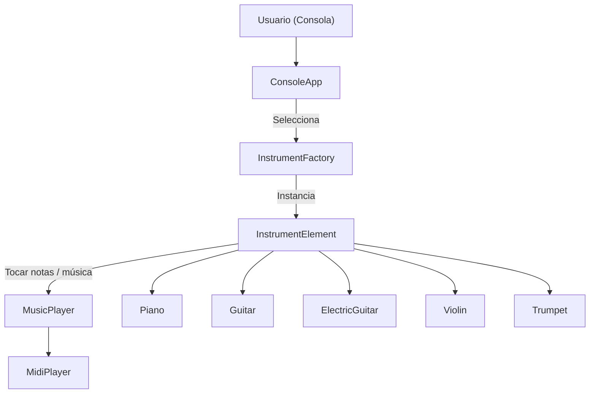

# Version java
## - java 21
# IDE
## - Intellij Idea ultimate 

# Documentacion Generada por IA, codigo por Edwin

## Arquitectura del Proyecto

Este proyecto emplea una **arquitectura hexagonal (puertos y adaptadores / Clean Architecture)** para separar la lógica de negocio del resto de componentes (UI, infraestructura, etc.), facilitando la escalabilidad y el mantenimiento.

### Diagrama de Arquitectura (ACCI)

### Componentes principales

- **Usuario:** Interactúa con el sistema a través de la consola.
- **ConsoleApp:** Controlador principal; gestiona el menú y el flujo de la aplicación.
- **InstrumentFactory:** Crea instancias de instrumentos según la selección del usuario.
- **InstrumentElement:** Clase abstracta. Los instrumentos concretos (Piano, Guitar, etc.) heredan de ella y definen sus propios métodos para tocar notas y música.
- **MusicPlayer:** Interfaz para reproducir notas y música. MidiPlayer es su implementación actual usando MIDI.
- **Infraestructura:** Implementa detalles técnicos como la reproducción de audio (MidiPlayer).

### Flujo principal

1. El usuario inicia la aplicación y escoge un instrumento.
2. ConsoleApp usa InstrumentFactory para crear el instrumento seleccionado.
3. El usuario puede tocar notas individuales, secuencias o canciones predefinidas.
4. InstrumentElement utiliza MusicPlayer (MidiPlayer) para reproducir el sonido.

### Ventajas de esta arquitectura

- **Separación de responsabilidades:** El núcleo del negocio no depende de detalles técnicos.
- **Escalabilidad:** Permite agregar nuevos tipos de instrumentos, reproductores o interfaces fácilmente.
- **Testabilidad:** La lógica de negocio y los contratos (interfaces) pueden probarse aisladamente.

### Recomendaciones

- Continúa documentando los módulos y su responsabilidad.
- Considera agregar pruebas unitarias utilizando mocks de los puertos.
- Si se agrega una interfaz gráfica o web, puede implementarse como otro adaptador sin modificar el núcleo.
